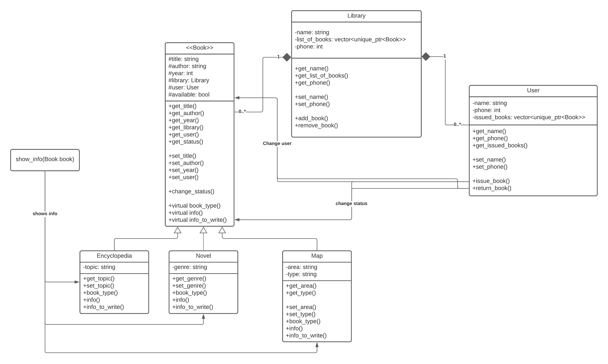

Stelmakh Mikalai, 316951  
Słomkowski Maciej,  
PROI, Semestr 21L

# System do obsługi biblioteki - Dokumentacja Projektu
# Zadanie
>Zadanie polega na zaprojektowaniu i zakodowaniu w C++ modelu dowolnego „systemu”, składającego się z obiektów należących przynajmniej do trzech klas (np. Element1, Element2 i Aplikacja).
>## Elementy języka C++
>Zgodnie z powyższym opisem projekt musi uwzględniać następujące elementy języka C++:
>* Dziedziczenie,
>* Polimorfizm,
>* Kontenery,
>* Szablon klasy,
>* Funkcja zaprzyjaźniona,
>* Czytanie/pisanie do pliku,
>* Wzorzec projektowy Singleton,
>* Wyjątki try, catch.
# Realizacja
Projekt składa się z dwóch części:
* Program
* Interfejs
## Program
Struktura projeku jest zgodna z poniższym diagramem:



Klasa `Library` została zrealizowana za pomocą wzorca projektowego Singleton, co oznacza, że nie może być stworzony więcej, niż jeden objekt klasy `Library`.  
Objekt klasy `Library` zawiera listę znajdujących się w niej książek typu `Encyclopedia, Fiction` lub `Map`. Klasy te dziedziczą po klasie bazowej `Book`. Wszystkie objekty klasy `Book` zawierają informację o nazwie, autorze, roku wydania, użytkowniku przez którego książka jest wypożyczona oraz jej status. Natomiast objekty klas `Encyclopedia, Fiction, Map` mają dodatkowe, własne atrybuty.  
Funkcja `show_info` jest zaprzyjaźniona z każdą klasą, co pozwala na dostęp do atrybutów prywatnych i wypisanie informacji o nich.  
Objekt klasy `User` ma listę wypożyczonych przez niego książek, ma możliwość wypożyczania i zwrotu książek.

## Interfejs
Interfejs został zrealizowany w postaci tekstowej. Logikę tego interfejsu można zobaczyć na poniższym diagramie:


Program rozpoczyna działanie od wczytywania informacji z pliku o bibliotece oraz o znajdujących się w niej książkach. Plik wejściowy może też zawierać informację o użytkownikach oraz o wypożyczonych przez nich książkach. 
Podczas działania programu użytkownik może zalogować się jako `admin` lub jako `user`.  
#### Możliwości `admin`:
* Wypisanie listy książek,
* Dodawanie/usuwanie książki.
#### Możliwości `user`:
* Wypisanie listy książek,
* Wypisanie listy wypożyczonych książek,
* Dodawanie/usuwanie użytkownika,
* Wypożyczenie/zwrot książki.  

Przy wyjściu z programu aktualny stan programu jest zapisywany w pliku, który przy ponownym uruchomieniu może posłużyć do przywrócenia jego stanu sprzed zamknięcia.
# Jak uruchomić
1. Wejść do folderu `/bin/`
1. Odtworzyć plik `Library.exe`
### lub
```bash
cd /bin/
./Library.exe
```
# Struktura pliku do wczytywania danych
```
Users{
UserName1
UserPhone1

UserName2
UserPhone2

...
...
}
Library{
LibraryName
LibraryPhone

Encyclopedias:
Title1  Author1 Year1   Topic1  UserName/None
Title2  Author2 Year2   Topic2  UserName/None
...

Fictions:
Title1  Author1 Year1   Genre1  UserName/None
Title2  Author2 Year2   Genre2  UserName/None
...

Maps:
Title1  Author1 Year1   Area1   Type1   UserName/None
Title2  Author2 Year2   Area2   Type2   UserName/None
...
}
```
# Podział pracy
## Mikalai Stelmakh
* task1
* task2
* task3
## Słomkowski Maciej
* task1
* task2
* task3
